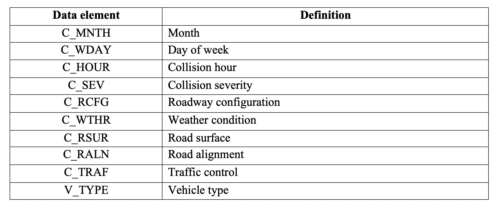

# National_Collision_DB_Group407

### Proposal

The data we are using is from the National Collision Database, it can be found on the [Government of Canada website](https://open.canada.ca/data/en/dataset/1eb9eba7-71d1-4b30-9fb1-30cbdab7e63a). It’s a database that contains all police-reported motor vehicle collisions on public roads in Canada. The data is from 1999 to 2017. Each row provides several data points for a passenger with the detailed summary statistics of the collision. Due to the huge amount of data in this dataset, we are only using the most recent data from 2017.

**Research Question**: What features are indicative of a accident causing fatality?

We started our project by first wrangling and cleaning our dataset. In the wrangling stage, we will limit the features to case level variable, which includes road conditions, time of accident, weather etc. We restricted other personal and vehicle level features as we are mainly interested in external causes of fatal accidents that can be controled with intervention.

The `C_ISEV` feature (Collision Severity) provides the fatality status of the accident, this will be our target. The target have two classes: `Collision producing at least one fatality` and `Collision producing non-fatal injury`. Our goal is to come up with a model that is able to make binary classification on the two classes of fatality status given the following features:

After splitting the data into train and test sets, we would like to predict which features strongly predict the fatality. We performed exploratory data analysis to our data, one major finding is that our data is highly imblanced between the two target classes. There are `179714` cases of non-fatal collisions and `2559` cases of fatal collisions, this may lead to biased accuracy of model evaluation.

We therefore took the extra step of balancing our data by downsampling the majority group. We choose to use more robust models like random forest and logistic regression for our classification problem. These models scales well to our large dataset with good performance. After selecting the most predictive features and tuning hyperparameters of our models, we end up creating a model with good accuracy in predicting fatal accidents. This would be useful for road assistant and medical agencies to prepare for emergencies under certain conditions that are more prone to having severe and fatal accidents.

More information about the meaning of each class for variables can be found [here](https://github.com/rita-ni/National_Collision_DB_Group407/blob/master/data/NCDB_Dictionary.pdf)

## Usage

To run the download script file, clone this GitHub repository, install the
[dependencies](#dependencies) listed below, and run the following
commands at the command line/terminal from the root directory of this
project:

    Rscript src/data_read.R --filepath='https://opendatatc.blob.core.windows.net/opendatatc/NCDB_2017.csv'
    python src/data_clean.py --read_path= data/file.csv --write_path= data/
    python src/eda.py --read_path= data/cleaned_train_data.csv --write_path= results/
    Rscript -e "rmarkdown::render('doc/eda_report.Rmd')"
    python src/ml_lgr_rf.py
    Rscript -e "rmarkdown::render('doc/final_report.Rmd')"

## Dependencies
Python 3.7.3 and Python packages:
- docopt==0.6.2
- pandas==0.25.1
- matplotlib==3.1.1
- altair==3.2.0
- numpy==1.17.2
- sklearn==0.0
- pandas-profiling==2.4.0

## License
National Collision Database documents are licensed under the
Open Government Licence - Canada. If re-using/re-mixing please provide attribution and link to this webpage.

## References

Transport Canada. 2017. “National Collision Database.”
Government of Canada; <https://open.canada.ca/data/en/dataset/1eb9eba7-71d1-4b30-9fb1-30cbdab7e63a>.

