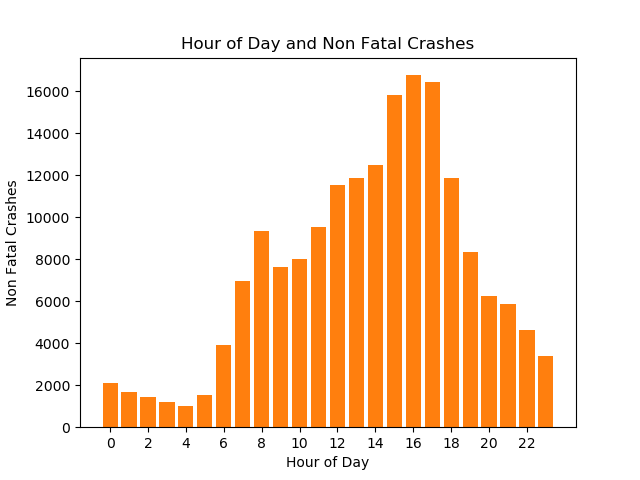

Exploratory data analysis of the National Collision Database
================

## Summary of the data set

The data we are using is from the National Collision Database and can be
found on the Government of Canada website. It’s a database that contains
all police-reported motor vehicle collisions on public roads in Canada.
The data we specifically chose was from 2017. Each row provides several
data points for a passenger with the detailed summary statistics of the
collision.

## Exploratory Analysis Of Training Set

We made several plots to identify which features were important to
predicting fatal and non-fatal car accidents.

### Hour of the Day and Fatal Crashes

As can be shown in the graph above, most of fatal accidents occur
between 14:00 to 16:00 indicating that are likely more cars on the road
as people are coming back home from work. It is also understandable that
few accidents occur at non-busy times such as 2:00am to 4:00am.

### Hour of the Day and Non-Fatal Crashes

 Similar to the fatal
accidents, the highest proportion of non-fatal accidents occur between
14:00 to 16:00 with the fewest occurring in the early morning hours.
None of this is surprising as it is expected more cars are to be on the
road during the afternoon.

### Features With Highest Fatal Crashes

The most important feature according to EDA for fatal collisions was
`C_TRAF_18` which is a variable indicating whether there was a traffic
control present. Thereby, locations with no traffic control experienced
higher fatal car collisions. Furthermore, we found it surprising that
the `C_WTHR_1` was an important feature indicating sunny and clear
weather. We would have expected higher collisions to take place during
less ideal weather. Lastly, we also found that normal and dry roads as
named `C_RSUR_1` was another critical feature for fatal-crashes.

### Features With Highest Non-Fatal Crashes

The most important feature according to EDA for non-fatal collisions was
`C_RALN_1` which is a variable describing the road alignment. Thereby,
locations with no straight and level roads had the most non-fatal car
crashes. Furthermore, we found it surprising that the `C_WTHR_1` was
also an important feature indicating sunny and clear weather. Lastly, we
also found that normal and dry roads as named `C_RSUR_1` was another
critical feature for non-fatal crashes.
