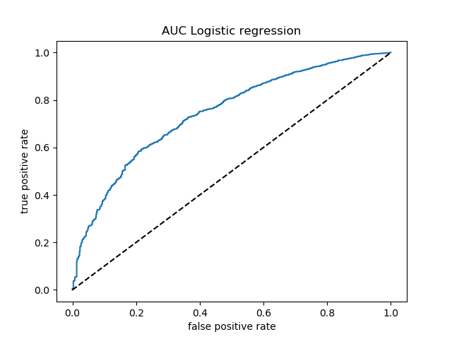

```{r setup, include=FALSE}
knitr::opts_chunk$set(echo = TRUE)

library(tidyverse)
library(knitr)

random_forest_classification <- read_csv("../results/rf_classification.csv")
random_forest_train_confusion <- read_csv("../results/rf_train_confusion.csv")
random_forest_test_confusion <- read_csv("../results/rf_test_confusion.csv")


log_reg_classification <- read_csv("../results/lgr_classification.csv")
log_reg_train_confusion <- read_csv("../results/lgr_train_confusion.csv")
log_reg_test_confusion <- read_csv("../results/lgr_test_confusion.csv")

errors <- read_csv("../results/errors.csv")

```

## Summary:

Here we attempt to build a classification model using a variety of different machine learning algorithms to distinguish between fatal and non-fatal car accidents based on a set of relevant features. Our best model gave us an f1-score of 0.45 and 0.99 for the fatal and non-fatal categories respectively. Despite poor initial results, we believe these values are decent starting points as our dataset is highly imbalanced. 


## Introduction:

It is quite unfortunate that every year thousands of Canadians die from health-related problems such as cancer and disease. However, based purely on a statistical odds it is more likely for an individual to die from a car accident. In 2017, over 150,000 individuals faced a car collision with over 1,800 unfortunately resulting in fatalities (Government of Canada, 2017). 

We want to harness the power machine learning to a rich dataset of car collision statistics to see if we can determine whether an accident will result in a fatality or not. By better understanding the predictive features which cause fatal accidents we can help inform policy makers to implement meaningful change and help save lives. 


## Methods:

National Car collision data were sourced from the [Government of Canada's Open Data website](http://open.canada.ca/en/open-data). Specifically, [National Collision Database 2017](https://open.canada.ca/data/en/dataset/1eb9eba7-71d1-4b30-9fb1-30cbdab7e63a).

The R programming language [@R] and R packages were used to perform the analysis as follow: 

- Tidyverse [@tidyverse]

- Stringr [@stringr]

- Testthat [@testthat]

- Docopt [@docopt]

The Python programming language [@python] and Python packages were used to perform the analysis as follow:

- Matplotlib [@matplotlib]

- Pandas [@mckinney2010data]

- Numpy [@oliphant2006guide]

- Scikit-Learn library[@scikit-learn]

- Docopt [@docopt]

- Seaborn [@seaborn]

- Altair [@Altair2018]


### Data:

The data we are using is from the National Collision Database and can be found on the Government of Canada website. It’s a database that contains all police-reported motor vehicle collisions on public roads in Canada. The data we specifically chose was from 2017. Each row provides several data points for a passenger with the detailed summary statistics of the collision.


### Analysis:

We applied several classification models including: Logistic Regression and the Random Forest Classifier. None of the data points in our dataset contained continuous variables as all of the values were discrete. For this reason,  we were required to create dummy variables for each of the classes in each column to prevent our model from learning false relationships within the data.  As an example, in the original dataset the `C_WDAY` has 7 different values ranging from 1 to 7. In this case, it is not appropriate to assert that day 4 is of greater importance than day 2, however, the machine learning model will pickup on this inherent relationship.

We used the Python programming language (Van Rossum and Drake 2009), Pandas library (McKinney 2010) and Scikit-Learn library (David Cournapeau, 2007) to wrangle data and perform the machine learning analysis. 

We did implement hyperparameter optimization for the max_depth parameter and number of features to be used for the random forest implementation. However, in interest of time and system speed, we haven't explored as many hyperparameters as intended.

### Results and Discussion:

Our training error turns out the be the following:

```{r}
kable(errors)
```


Accuracy is not an appropriate measure to include for our analysis here because the data is highly imbalanced. Virtually any classification model can achieve high accuracy when the data is highly imbalanced, however, a more useful metric is the f1-score. Overall we found that the Random Forest classification model performed the best with the highest overall f1-score of 0.45 and 0.99 for the fatal and non-fatal classes respectively. 

After balancing the dataset using upward balancing techniques, we find that the test confusion matrix seems quite balanced evidenced by a convincing AUC plot. However, when exposed to new test data, both the algorithms don't predict very well. The tendency is to classify actual fatal accidents as non-fatal. Since we would like to identify fatalities better so that medical services and emergency services could be notified, we should be looking at a system with higher precision.

#### Random Forest Results Classification report

```{r}
kable(random_forest_classification)
```

#### Random Forest Results Confusion matrix on the test data

```{r}
kable(random_forest_train_confusion)

```


#### Random Forest Results Confusion matrix on the test data

```{r}
kable(random_forest_test_confusion)

```


#### Logistic Regression Classification report

```{r}
kable(log_reg_classification)

```

#### Logistic regression confusion matrix on training data

```{r}
kable(log_reg_train_confusion)

```


#### Logistic regression confusion matrix on test data

```{r}
kable(log_reg_test_confusion)
```


#### AUC comparisons




# Changes and future improvements

Since the previous release, we have succesfully demonstrated the usage of hyperparameter optimization using GridSearchCV, implemented a ML automation pipeline, added more tables to better support the conclusion and improved the data imbalance. There are plenty more improvements (scalability, additional hyperparameter optimization) and can be a focus outside the academic nature of this analysis.As a whole we believe there are further improvements that can be made in future iterations of this project. We believe that using more data from previous years can help us better learn the temporal relationships and seasonality which may be present. Though this doesn't demonstrate causation, some limitations of our analysis includes that diease is a large cause of death besides car accidents[@Iii].


# References

