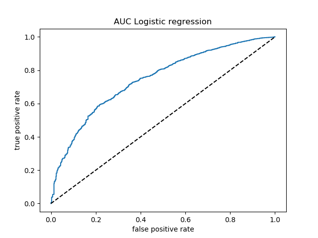

Predicting Car Crash Fatalities and Proposing Solutions to Save Lives
================

## Summary:

Here we attempt to build a classification model using a variety of
different machine learning algorithms to distinguish between fatal and
non-fatal car accidents based on a set of relevant features. Our best
model gave us an f1-score of 0.45 and 0.99 for the fatal and non-fatal
categories respectively. Despite poor initial results, we believe these
values are decent starting points as our dataset is highly imbalanced.

## Introduction:

It is quite unfortunate that every year thousands of Canadians die from
health-related problems such as cancer and disease. However, based
purely on a statistical odds it is more likely for an individual to die
from a car accident. In 2017, over 150,000 individuals faced a car
collision with over 1,800 unfortunately resulting in fatalities
(Government of Canada, 2017).

We want to harness the power machine learning to a rich dataset of car
collision statistics to see if we can determine whether an accident will
result in a fatality or not. By better understanding the predictive
features which cause fatal accidents we can help inform policy makers to
implement meaningful change and help save lives.

## Methods:

National Car collision data were sourced from the [Government of
Canada’s Open Data website](http://open.canada.ca/en/open-data).
Specifically, [National Collision
Database 2017](https://open.canada.ca/data/en/dataset/1eb9eba7-71d1-4b30-9fb1-30cbdab7e63a).

The R programming language (R Core Team 2019) and R packages were used
to perform the analysis as follow:

  - Tidyverse (Wickham 2017)

  - Stringr (Wickham 2019)

  - Testthat (Wickham 2011)

  - Docopt (de Jonge 2018)

The Python programming language (Van Rossum and Drake 2009) and Python
packages were used to perform the analysis as follow:

  - Matplotlib (Hunter 2007)

  - Pandas (McKinney and others 2010)

  - Numpy (Oliphant 2006)

  - Scikit-Learn library(Pedregosa et al. 2011)

  - Docopt (de Jonge 2018)

  - Seaborn (Waskom and others 2017)

  - Altair (VanderPlas et al. 2018)

### Data:

The data we are using is from the National Collision Database and can be
found on the Government of Canada website. It’s a database that contains
all police-reported motor vehicle collisions on public roads in Canada.
The data we specifically chose was from 2017. Each row provides several
data points for a passenger with the detailed summary statistics of the
collision.

### Analysis:

We applied several classification models including: Logistic Regression
and the Random Forest Classifier. None of the data points in our dataset
contained continuous variables as all of the values were discrete. For
this reason, we were required to create dummy variables for each of the
classes in each column to prevent our model from learning false
relationships within the data. As an example, in the original dataset
the `C_WDAY` has 7 different values ranging from 1 to 7. In this case,
it is not appropriate to assert that day 4 is of greater importance than
day 2, however, the machine learning model will pickup on this inherent
relationship.

We used the Python programming language (Van Rossum and Drake 2009),
Pandas library (McKinney 2010) and Scikit-Learn library (David
Cournapeau, 2007) to wrangle data and perform the machine learning
analysis.

We did implement hyperparameter optimization for the max\_depth
parameter and number of features to be used for the random forest
implementation. However, in interest of time and system speed, we
haven’t explored as many hyperparameters as intended.

### Results and Discussion:

Our training error turns out the be the following:

``` r
kable(errors)
```

| X1    | Random Forest |   Log |
| :---- | ------------: | ----: |
| Train |         0.027 | 0.295 |
| Test  |         0.296 | 0.310 |

Accuracy is not an appropriate measure to include for our analysis here
because the data is highly imbalanced. Virtually any classification
model can achieve high accuracy when the data is highly imbalanced,
however, a more useful metric is the f1-score. Overall we found that the
Random Forest classification model performed the best with the highest
overall f1-score of 0.45 and 0.99 for the fatal and non-fatal classes
respectively.

After balancing the dataset using upward balancing techniques, we find
that the test confusion matrix seems quite balanced evidenced by a
convincing AUC plot. However, when exposed to new test data, both the
algorithms don’t predict very well. The tendency is to classify actual
fatal accidents as non-fatal. Since we would like to identify fatalities
better so that medical services and emergency services could be
notified, we should be looking at a system with higher precision.

#### Random Forest Results Classification report

``` r
kable(random_forest_classification)
```

| X1        |            1 |            2 |  accuracy |    macro avg | weighted avg |
| :-------- | -----------: | -----------: | --------: | -----------: | -----------: |
| precision |    0.9672194 |    0.9798020 | 0.9734271 |    0.9735107 |    0.9735107 |
| recall    |    0.9800703 |    0.9667839 | 0.9734271 |    0.9734271 |    0.9734271 |
| f1-score  |    0.9736025 |    0.9732494 | 0.9734271 |    0.9734259 |    0.9734259 |
| support   | 2559.0000000 | 2559.0000000 | 0.9734271 | 5118.0000000 | 5118.0000000 |

#### Random Forest Results Confusion matrix on the test data

``` r
kable(random_forest_train_confusion)
```

| X1        | Not fatal | Fatal |
| :-------- | --------: | ----: |
| Not fatal |      2508 |    51 |
| Fatal     |        85 |  2474 |

#### Random Forest Results Confusion matrix on the test data

``` r
kable(random_forest_test_confusion)
```

| X1        | Not fatal | Fatal |
| :-------- | --------: | ----: |
| Not fatal |       590 |    81 |
| Fatal     |     13393 | 31470 |

#### Logistic Regression Classification report

``` r
kable(log_reg_classification)
```

| X1        |            1 |            2 |  accuracy |    macro avg | weighted avg |
| :-------- | -----------: | -----------: | --------: | -----------: | -----------: |
| precision |    0.7087147 |    0.7013436 | 0.7049629 |    0.7050291 |    0.7050291 |
| recall    |    0.6959750 |    0.7139508 | 0.7049629 |    0.7049629 |    0.7049629 |
| f1-score  |    0.7022871 |    0.7075910 | 0.7049629 |    0.7049390 |    0.7049390 |
| support   | 2559.0000000 | 2559.0000000 | 0.7049629 | 5118.0000000 | 5118.0000000 |

#### Logistic regression confusion matrix on training data

``` r
kable(log_reg_train_confusion)
```

| X1        | Not fatal | Fatal |
| :-------- | --------: | ----: |
| Not fatal |      1781 |   778 |
| Fatal     |       732 |  1827 |

#### Logistic regression confusion matrix on test data

``` r
kable(log_reg_test_confusion)
```

| X1        | Not fatal | Fatal |
| :-------- | --------: | ----: |
| Not fatal |       446 |   225 |
| Fatal     |     13900 | 30963 |

#### AUC comparisons

 

# Changes and future improvements

Since the previous release, we have succesfully demonstrated the usage
of hyperparameter optimization using GridSearchCV, implemented a ML
automation pipeline, added more tables to better support the conclusion
and improved the data imbalance. There are plenty more improvements
(scalability, additional hyperparameter optimization) and can be a focus
outside the academic nature of this analysis.As a whole we believe there
are further improvements that can be made in future iterations of this
project. We believe that using more data from previous years can help us
better learn the temporal relationships and seasonality which may be
present. Though this doesn’t demonstrate causation, some limitations of
our analysis includes that diease is a large cause of death besides car
accidents(2020).

# References

<div id="refs" class="references">

<div id="ref-docopt">

de Jonge, Edwin. 2018. *Docopt: Command-Line Interface Specification
Language*. <https://CRAN.R-project.org/package=docopt>.

</div>

<div id="ref-matplotlib">

Hunter, J. D. 2007. “Matplotlib: A 2D Graphics Environment.” *Computing
in Science & Engineering* 9 (3): 90–95.
<https://doi.org/10.1109/MCSE.2007.55>.

</div>

<div id="ref-mckinney2010data">

McKinney, Wes, and others. 2010. “Data Structures for Statistical
Computing in Python.” In *Proceedings of the 9th Python in Science
Conference*, 445:51–56. Austin, TX.

</div>

<div id="ref-oliphant2006guide">

Oliphant, Travis E. 2006. *A Guide to Numpy*. Vol. 1. Trelgol Publishing
USA.

</div>

<div id="ref-scikit-learn">

Pedregosa, F., G. Varoquaux, A. Gramfort, V. Michel, B. Thirion, O.
Grisel, M. Blondel, et al. 2011. “Scikit-Learn: Machine Learning in
Python.” *Journal of Machine Learning Research* 12: 2825–30.

</div>

<div id="ref-R">

R Core Team. 2019. *R: A Language and Environment for Statistical
Computing*. Vienna, Austria: R Foundation for Statistical Computing.
<https://www.R-project.org/>.

</div>

<div id="ref-Altair2018">

VanderPlas, Jacob, Brian Granger, Jeffrey Heer, Dominik Moritz, Kanit
Wongsuphasawat, Eitan Lees, Ilia Timofeev, Ben Welsh, and Scott Sievert.
2018. “Altair: Interactive Statistical Visualizations for Python.”
*Journal of Open Source Software*, December.
<https://doi.org/10.21105/joss.01057>.

</div>

<div id="ref-python">

Van Rossum, Guido, and Fred L. Drake. 2009. *Python 3 Reference Manual*.
Scotts Valley, CA: CreateSpace.

</div>

<div id="ref-seaborn">

Waskom, Michael, and others. 2017. “Mwaskom/Seaborn: V0.8.1 (September
2017).” <https://doi.org/10.5281/zenodo.883859>.

</div>

<div id="ref-testthat">

Wickham, Hadley. 2011. “Testthat: Get Started with Testing.” *The R
Journal* 3: 5–10.
<https://journal.r-project.org/archive/2011-1/RJournal_2011-1_Wickham.pdf>.

</div>

<div id="ref-tidyverse">

———. 2017. *Tidyverse: Easily Install and Load the ’Tidyverse’*.
<https://CRAN.R-project.org/package=tidyverse>.

</div>

<div id="ref-stringr">

———. 2019. *Stringr: Simple, Consistent Wrappers for Common String
Operations*. <https://CRAN.R-project.org/package=stringr>.

</div>

<div id="ref-Iii">

2020\. *Iii.org*.
<https://www.iii.org/fact-statistic/facts-statistics-mortality-risk>.

</div>

</div>
